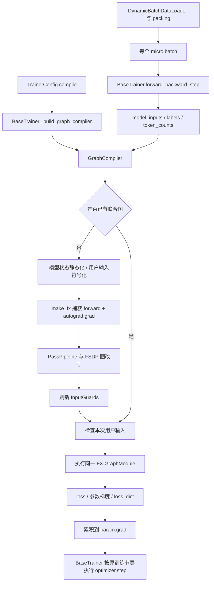

# HyperParallel 静态图动态 Shape 开发说明

本文记录 `/home/whh/0929_newdynamic` 第一阶段动态 shape 实现，包括设计取舍、代码调用链、BaseTrainer 接入和 NPU 验证。代码与行号对应 2026-09-30 第一阶段快照。本文中的文件链接相对于仓库根目录；后续代码修改可能使行号变化。

后续已补充“通用图 + 按尺寸懒生成专用图 + 缓存分派”的功能穿刺，见 [第二阶段开发说明](size_specialization_development.md)。下文“尚未实现热点尺寸特化”等表述描述第一阶段边界，最新实现和验证结果以第二阶段说明为准。

当前实现可以在输入 batch size、sequence length 变化时复用同一份前向与反向联合 FX 图。已完成 CPU 数值对照、两进程 FSDP 验证，以及 NPU 上 Qwen3-0.6B 模型结构的 TP2 + FSDP2 动态文本训练验证。

这里的“静态图”表示算子拓扑被捕获并复用；图中的部分张量尺寸仍可通过 `SymInt` 表达。当前执行对象是经过并行 Pass 改写的 FX `GraphModule`，不能把“一次图捕获”理解为已经实现所有底层算子的融合编译、NPU Graph capture 或任意动态控制流。

## 1. 从 MagiCompiler 借鉴了什么

参考材料是仓库根目录的 [magicompile_analysis.md](magicompile_analysis.md)。`MagiCompiler/` 是独立的三方仓库，当前功能不依赖导入它。

| MagiCompiler 分析中的思路 | HyperParallel 本次落地方式 |
| --- | --- |
| 通过 `dynamic_arg_dims` 指定动态维度 | 保留同类用户接口，支持嵌套路径、单个维度、维度列表和负维度 |
| 未选中的维度保持静态 | 为每个用户张量明确构造 `DimDynamic.DYNAMIC/STATIC` |
| FakeTensor 传播时保留符号维度信息 | 直接在现有 `make_fx` 入口建立 `ShapeEnv` 和 `StatelessSymbolicContext` |
| 优先复用通用符号图 | 首次捕获，后续满足 guard 的输入复用该图 |
| 热点尺寸特化、分段编译、图缓存与 CUDA Graph | 本阶段未实现，后续按需要扩展 |

两套代码的捕获入口不同：MagiCompiler 的分析主要围绕 Dynamo；HyperParallel 当前联合图由 `make_fx + autograd.grad` 捕获。因此，仅在真实输入上调用 `torch._dynamo.mark_dynamic()`，不能完成当前路径的符号化和执行期检查。本次把动态维度选择放到了真正创建 FakeTensor 的地方，并为直接调用的 FX 图补上 guard。

设计目标是让普通用户只增加 `compile.dynamic: true` 就能尝试动态输入，同时给需要精确控制的用户提供 `dynamic_arg_dims`。

## 2. 代码结构与阅读入口

| 文件 / 入口 | 作用 | 本次工作 |
| --- | --- | --- |
| [build_options.py:107](hyper_parallel/models/build_options.py#L107) | `CompileConfig`，承载 YAML 配置 | 新增维度映射配置，明确 joint graph 的动态语义 |
| [compiler.py:59](hyper_parallel/compile/compiler.py#L59) | `GraphCompiler`，组织捕获、Pass、执行和梯度累积 | 读取动态配置、传给 tracer、刷新 guard、阻止动态 PP |
| [dynamic_shapes.py:29](hyper_parallel/compile/tracer/dynamic_shapes.py#L29) | 维度映射校验、FakeTensor 符号化、运行时 guard | 新增核心模块 |
| [graph_tracer.py:402](hyper_parallel/compile/tracer/graph_tracer.py#L402) | 捕获前向与反向联合图 | 增加符号输入分支、padding decomposition、保存 guard |
| [graph_tracer.py:614](hyper_parallel/compile/tracer/graph_tracer.py#L614) | `run_traced_graph` | 执行图前检查用户输入 |
| [compile/trainer.py:55](hyper_parallel/compile/trainer.py#L55) | 独立的 `GraphTrainer` 封装 | 透传动态配置 |
| [trainer/base.py:439](hyper_parallel/trainer/base.py#L439) | 主训练流程的 GraphCompiler 入口 | 沿用配置入口，补齐 token 计数的显式输入 |
| [fsdp_pass.py:105](hyper_parallel/compile/passes/parallel/fsdp_pass.py#L105) | 参数 all-gather、梯度 reduce-scatter、模型分片 | 复用现有实现，验证其与符号输入协作 |
| [dynamic_shapes.py:30](hyper_parallel/compile/examples/dynamic_shapes.py#L30) | 小型 CPU 示例 | 可直接运行的动态 batch/sequence 数值对照 |
| [动态文本配置:1](hyper_parallel/compile/examples/automodel_text_graph/train_online_lm_graph_dynamic_tp2_fsdp2.yaml#L1) | 在线 packing + NPU TP2/FSDP2 | 新增完整训练示例 |
| [verify_dynamic_training.py:29](hyper_parallel/compile/examples/automodel_text_graph/verify_dynamic_training.py#L29) | 对正常 TextTrainer 训练做审计 | 记录 shape、编译次数、loss 和优化器步数 |

## 3. 完整调用流程



首次调用的主线在 [compiler.py:138](hyper_parallel/compile/compiler.py#L138)：

```python
trace_kwargs = {}
if self.dynamic or self.dynamic_arg_dims is not None:
    trace_kwargs = {"dynamic": self.dynamic, "dynamic_arg_dims": self.dynamic_arg_dims}
joint_graph = trace_model_graph(self.model, self.train_fn, inputs, **trace_kwargs)

pipeline = PassPipeline.from_config(self.pass_config, self.parallel_plan)
pass_kwargs = self._build_pass_kwargs()
pipeline.run(joint_graph.graph_module, **pass_kwargs)

if joint_graph.input_guards is not None:
    joint_graph.input_guards.refresh()
self._joint_graph = joint_graph
```

代码节选自第 164 行起，中间省略注释。后续调用 [compiler.py:180](hyper_parallel/compile/compiler.py#L180) 的 `forward_backward()` 时，只有 `_joint_graph is None` 才捕获；每个新 shape 不会自动触发一次编译。

## 4. 配置与用户接口

### 4.1 BaseTrainer / TextTrainer 的最小配置

```yaml
compile:
  enabled: true
  use_joint_graph: true
  dynamic: true
```

配置定义见 [build_options.py:119](hyper_parallel/models/build_options.py#L119)。[BaseTrainer._build_graph_compiler:439](hyper_parallel/trainer/base.py#L439) 已将完整 `trainer_config` 传入编译器；[compiler.py:94](hyper_parallel/compile/compiler.py#L94) 从其中读取动态配置，无需再增加一套训练入口。

| 配置组合 | 实际语义 |
| --- | --- |
| `dynamic: false`，没有映射 | 默认静态捕获路径 |
| `dynamic: true`，没有映射 | 尝试符号化所有用户张量维度；模型参数和 buffer 仍为静态尺寸 |
| 提供 `dynamic_arg_dims` 映射 | 仅选中维度动态；即使 `dynamic: false` 也启用符号捕获 |
| `dynamic_arg_dims: {}` | 使用符号捕获机制，但不选择任何动态维度 |

`dynamic=True` 不保证尺寸 0/1、形状分支或算子约束都能泛化，详见后文限制。

### 4.2 精确选择动态维度

路径从传给 `forward_backward(**inputs)` 的顶层关键字开始。BaseTrainer 的模型输入位于 `model_inputs` 下，因此可写成：

```yaml
compile:
  enabled: true
  use_joint_graph: true
  dynamic_arg_dims:
    model_inputs.input_ids: [1]
    labels: [1]
```

这是路径写法示例，适用于输入只有这些相关张量的情形。如果实际还传入随序列长度变化的 `attention_mask`、`position_ids`，也要标记它们的相关维度。例如 mask 若为 `[B, 1, L, L]`，变化的是后两维；若为 `[B, L]`，则只需标记末维。新增在线文本示例采用 `dynamic: true`，避免用户先枚举这些输入。

路径解析与校验分别位于 [dynamic_shapes.py:46](hyper_parallel/compile/tracer/dynamic_shapes.py#L46) 和 [dynamic_shapes.py:81](hyper_parallel/compile/tracer/dynamic_shapes.py#L81)：支持字典键、非负列表下标、属性路径；最终对象必须是已注册 pytree 中的 Tensor 叶子。维度可以为 `-1`，列表路径下标不支持负数。

### 4.3 独立 GraphCompiler 示例

以下示例与仓库的 [CPU 示例:25](hyper_parallel/compile/examples/dynamic_shapes.py#L25) 对应，保留 batch、sequence 两维动态，特征维度固定：

```python
import torch
from hyper_parallel.compile import GraphCompiler, PassConfig

def train_fn(model, x, y):
    return (model(x) - y).square().mean()

model = torch.nn.Linear(4, 3)
compiler = GraphCompiler(
    model,
    train_fn,
    pass_config=PassConfig(fsdp_enabled=False),
    dynamic_arg_dims={"x": [0, 1], "y": [0, 1]},
    device=torch.device("cpu"),
)

for batch, sequence in [(2, 5), (3, 7), (4, 3)]:
    x = torch.randn(batch, sequence, 4)
    y = torch.randn(batch, sequence, 3)
    model.zero_grad()
    loss, loss_dict = compiler.forward_backward(x=x, y=y)
    # 此时 model.parameters() 的 .grad 已经被填充。
    # forward_backward 本身不执行 optimizer.step()。
```

运行仓库完整示例还会逐次比较 eager 的 loss 和所有参数梯度：

```bash
cd /home/whh/0929_newdynamic
python -m hyper_parallel.compile.examples.dynamic_shapes
```

## 5. 符号输入如何建立

### 5.1 将模型状态与用户输入分开

[graph_tracer.py:430](hyper_parallel/compile/tracer/graph_tracer.py#L430) 抽取参数和 buffer；第 445 行起展开用户输入。联合图的输入顺序为：

```text
[参数和 buffer 的扁平序列] + [用户输入 pytree 的扁平序列]
```

这样权重始终是图的显式输入，运行时可以传入当前模型状态。动态选择只作用于用户输入，线性层权重等尺寸不会因为开启 `dynamic=True` 而被全部符号化。

### 5.2 为每一维建立明确策略

核心代码位于 [dynamic_shapes.py:98](hyper_parallel/compile/tracer/dynamic_shapes.py#L98)：

```python
fake_mode = FakeTensorMode(allow_non_fake_inputs=True, shape_env=ShapeEnv(duck_shape=False))
fake_args = [fake_mode.from_tensor(value, static_shapes=True) for value in state_flat]
```

每个用户张量随后使用以下逻辑（[第 107 行](hyper_parallel/compile/tracer/dynamic_shapes.py#L107)）：

```python
dims = dynamic_dims.get(id(value), set())
context = StatelessSymbolicContext(
    dynamic_sizes=[DimDynamic.DYNAMIC if dim in dims else DimDynamic.STATIC for dim in range(value.ndim)]
)
fake_args.append(fake_mode.from_tensor(value, source=LocalSource(f"input_{index}"), symbolic_context=context))
```

例如实际样本 `x.shape == (2, 5, 4)`，选中 `[0, 1]` 后，捕获中可理解为 `(s0, s1, 4)`。reshape、切片、归约等操作在支持符号尺寸的路径上继续传播这些符号。

`duck_shape=False` 防止两个维度仅因首次样本数值相同就被当成同一符号。假设初始 batch 和 sequence 恰好都是 4，之后 `(3, 7)` 应该仍可合法；真正需要相等的尺寸关系由运算本身产生约束。对应测试在 [test_dynamic_shapes.py:92](tests/ut/compile/test_dynamic_shapes.py#L92)。

如果多个输入路径引用同一个 Tensor 对象，选择维度按对象身份合并，见 [dynamic_shapes.py:92](hyper_parallel/compile/tracer/dynamic_shapes.py#L92)。实现不会在用户真实张量上遗留 Dynamo 标记。

### 5.3 前向与反向一起捕获

[graph_tracer.py:478](hyper_parallel/compile/tracer/graph_tracer.py#L478) 的 `_fwd_bwd_fn` 将扁平输入还原，然后临时将模型状态替换为传入的状态张量，执行训练函数。反向在捕获过程中由 `torch.autograd.grad()` 展开。

输出布局为：

```text
[loss] + [可训练参数的梯度] + [loss_dict 中的值]
```

因此后续执行 FX 图时，不再对返回的 loss 调用一次 `backward()`；梯度已经是图输出的一部分。`run_traced_graph()` 在 `torch.no_grad()` 下执行图，再拆分这些结果，见 [graph_tracer.py:664](hyper_parallel/compile/tracer/graph_tracer.py#L664)。

## 6. 为什么需要运行时 guard

同一算子图只能处理满足其约束的输入。允许序列长度变化，并不意味着允许输入 dtype、rank、Python 常量、分支选择或所有 stride 任意变化。

因为当前直接调用 `GraphModule`，Dynamo 不会代为执行输入检查。本次新增 [InputGuards:115](hyper_parallel/compile/tracer/dynamic_shapes.py#L115)，检查分为三层：

| 检查 | 代码入口 | 防止的问题 |
| --- | --- | --- |
| pytree 结构 | [graph_tracer.py:647](hyper_parallel/compile/tracer/graph_tracer.py#L647) | 输入键、嵌套结构发生变化，导致 placeholder 错位 |
| 张量元数据、Python 常量、对象身份复用关系 | [dynamic_shapes.py:132](hyper_parallel/compile/tracer/dynamic_shapes.py#L132) | dtype/rank/device 改变，或原来同一输入对象变成两个对象 |
| ShapeEnv 表达式 | [dynamic_shapes.py:145](hyper_parallel/compile/tracer/dynamic_shapes.py#L145) | 静态维度、关联尺寸、stride/storage offset 或形状分支约束不满足 |

这里的 alias 检查记录的是“是否为同一个 Tensor 对象”，不是完整的任意 storage 重叠分析。

```python
# dynamic_shapes.py:145
def refresh(self) -> None:
    self.expression = self.shape_env.produce_guards_expression(self.fake_tensors, ignore_static=False)
```

执行时先 `validate(user_flat)`，再调用 FX 图，见 [graph_tracer.py:659](hyper_parallel/compile/tracer/graph_tracer.py#L659)。`ignore_static=False` 使未选择的维度也受到检查。Pass 运行后再次刷新 guard，纳入图改写阶段可能引入的约束。

例如训练函数有 `if x.shape[1] > 8`，首次捕获只会记录当时执行的分支；后续输入跨过边界必须拒绝，不能沿错误分支继续计算。对应测试在 [test_dynamic_shapes.py:134](tests/ut/compile/test_dynamic_shapes.py#L134)。

guard 只覆盖用户输入，不将 FSDP 改写前的完整参数 shape 当成执行期约束。FSDP 会合法地把真实模型参数变成分片。guard 保存 FakeTensor、ShapeEnv 和元数据，不持有样本真实张量存储，相关测试见 [test_dynamic_shapes.py:204](tests/ut/compile/test_dynamic_shapes.py#L204)。

当前 guard 失败会抛出 `ValueError`，没有自动重新捕获。原因之一是 FSDP Pass 已经修改了真实模型参数布局，直接拿分片状态再次捕获并不安全。这也不是跨 rank 的失败协商机制；多卡输入仍需满足相应通信组的共同约束。

## 7. BaseTrainer 中容易遗漏的 token 计数

动态 packing 不仅改变输入 shape，还改变有效 token 数；即使 shape 完全相同，`ignore_index` 分布不同也会改变 loss 权重。

原先如果训练函数通过闭包读取 `self.current_token_counts` 等属性，捕获可能把首次计数绑定进图，后续更新 Python 属性不会自动变成新的图输入。本次将两组计数显式传入：

```python
# trainer/base.py:664
graph_kwargs = {}
if hasattr(self, "current_token_counts") and hasattr(self, "step_token_counts"):
    graph_kwargs["token_counts"] = {
        "current": self.current_token_counts,
        "step": self.step_token_counts,
    }
loss, loss_dict = self.graph_compiler.forward_backward(
    model_inputs=micro_batch,
    labels=labels,
    **graph_kwargs,
)
```

计数在 [BaseTrainer.train_step:770](hyper_parallel/trainer/base.py#L770) 附近按 step/micro step 计算，经 `_graph_train_fn()` 传给 `postforward()`。后者在 [第 596 行](hyper_parallel/trainer/base.py#L596) 选择本次传入的计数，再调用原有 `mean_global_loss()`。

计数本身通常是标量 Tensor；需要变化的是 Tensor 的数值，不要求新增一个动态 shape 维度。它们作为 placeholder 输入后，算子每次都读取当前值。

[metrics.py:112](hyper_parallel/trainer/runtime/metrics.py#L112) 的既有计算可概括为：

```python
step_len = differentiable_all_reduce(step_token_counts[...], "sum", dp_cp_group)
local_weighted_loss = cur_loss * cur_token_len
backward_loss = local_weighted_loss / step_len * device_mesh.dp_size * device_mesh.cp_size
```

省略号表示具体 loss 对应的计数字典键。此次没有修改这套加权公式，改变的是计数进入图的方式。测试 [test_dynamic_shapes.py:312](tests/ut/compile/test_dynamic_shapes.py#L312) 专门验证计数变化时 loss 和梯度随之变化，并继续复用图。

## 8. NPU causal loss 的 padding 为什么需要 decomposition

实际 Qwen 文本训练曾在输入长度从 126 变成 116 时触发 guard。定位发现，causal loss 对 labels 执行 constant padding 时，当前环境的原生路径将符号长度特化为首次样本长度，随后交叉熵的尺寸关系又将该限制传播到 logits。

典型计算模式如下，对应 [NPU 回归测试:38](tests/torch/compile/_test_dynamic_shapes_npu.py#L38)：

```python
shifted = torch.nn.functional.pad(y, (0, 1), value=-100)[..., 1:].contiguous()
loss = torch.nn.functional.cross_entropy(
    module(x).float().flatten(0, 1), shifted.flatten()
)
```

处理位置是 [graph_tracer.py:553](hyper_parallel/compile/tracer/graph_tracer.py#L553)：

```python
decompositions = get_decompositions([torch.ops.aten.constant_pad_nd.default]) if symbolic else None
traced_graph = make_fx(
    _fwd_bwd_fn, decomposition_table=decompositions, **_MAKE_FX_KWARGS
)(*fake_args)
```

这里采用 PyTorch 自带 decomposition，将 constant padding 展开为能够传播符号尺寸的基础操作，保留 pad、shift、交叉熵的原有语义。它只在符号捕获时启用；没有放宽 guard，也没有替换成简化训练损失。

NPU 小模型回归在 FP32 和 BF16 下分别测试长度 5、7、11，每个长度都比较 eager loss 和所有参数梯度，并检查只捕获一次，见 [测试第 42 行](tests/torch/compile/_test_dynamic_shapes_npu.py#L42)。

## 9. 与 FSDP、TP、优化器的关系

FSDP 图处理沿用 [FSDPPass.run:105](hyper_parallel/compile/passes/parallel/fsdp_pass.py#L105)：识别参数 placeholder，在使用参数前插入 all-gather，在参数梯度输出处插入 reduce-scatter，随后将真实模型参数分片。

| 操作 | 代码位置 |
| --- | --- |
| 插入参数 all-gather | [fsdp_pass.py:376](hyper_parallel/compile/passes/parallel/fsdp_pass.py#L376) |
| 插入梯度 reduce-scatter | [fsdp_pass.py:433](hyper_parallel/compile/passes/parallel/fsdp_pass.py#L433) |
| 修改真实模型参数为分片 | [fsdp_pass.py:290](hyper_parallel/compile/passes/parallel/fsdp_pass.py#L290) |
| 每步传入当前模型状态 | [compiler.py:282](hyper_parallel/compile/compiler.py#L282) |
| 将图输出梯度累积到参数 | [compiler.py:298](hyper_parallel/compile/compiler.py#L298) |

输入 batch/sequence 改变时，线性层权重形状通常不变，因此参数通信和梯度通信不需要因为 activation 的序列长度改变而重建。不同 DP 分片可以处理不同长度；同一 TP 组仍需提供匹配的输入与通信形状。本次实际验证正是同一 TP 对输入长度一致、不同 DP 组长度不同。

本次没有新增 TP Pass，动态功能接入现有 AutoModel/并行训练路径。也没有改变 `forward_backward()` 的梯度累积契约：多个不同 shape 的 micro batch 可以依次累积，随后由 BaseTrainer 执行优化器更新和清梯度。

动态 PP 当前在 [compiler.py:149](hyper_parallel/compile/compiler.py#L149) 明确拒绝，并且拒绝发生在捕获和 Pass 修改模型之前。PP 的激活通信尺寸与缓冲区生命周期需要单独适配。

## 10. 动态文本示例怎样产生不同 shape

新增配置是 [train_online_lm_graph_dynamic_tp2_fsdp2.yaml](hyper_parallel/compile/examples/automodel_text_graph/train_online_lm_graph_dynamic_tp2_fsdp2.yaml)。

数据路径如下，使用仓库现有 dynamic batching 组件：

```text
变长 JSONL 文本
  → tokenizer / plaintext transform
  → DynamicBatchDataLoader
  → TextTokenBatcher 按 token budget 选择样本
  → TextPackingCollator 拼成 [1, packed_length]
  → ParallelBatch 整理模型输入、attention 信息和 labels
  → TextTrainer / BaseTrainer
```

可继续阅读 [TextTokenBatcher:306](hyper_parallel/data/batching/build_dataloader.py#L306)、[DynamicBatchDataLoader:469](hyper_parallel/data/batching/build_dataloader.py#L469)、[TextPackingCollator:71](hyper_parallel/data/batching/build_collate_fn.py#L71) 和 [ParallelBatch:131](hyper_parallel/data/batching/get_batch.py#L131)。

`max_seq_len: 128` 在此提供长度预算，packing 实际填充量可以小于预算。示例改变的是拼接后物理张量的序列维度；物理 batch 维保持 1。通用编译器对 batch 维变化的支持另外由 CPU 示例和单测覆盖，不能从这次文本测试推断 batch 维也变过。

生成器 [prepare_dynamic_text.py:22](hyper_parallel/compile/examples/automodel_text_graph/prepare_dynamic_text.py#L22) 生成 384 条长度不同的确定性文本，无需下载额外训练数据集。

### 10.1 在当前容器内复现

从仓库根目录执行；Python 的 editable install 应指向当前 checkout：

```bash
cd /home/whh/0929_newdynamic
python -c 'import hyper_parallel; print(hyper_parallel.__file__)'
python hyper_parallel/compile/examples/automodel_text_graph/prepare_dynamic_text.py
```

如果导入路径指向别的 checkout，先在本目录执行 `python -m pip install -e .`。

下面是带审计的四卡运行方式。模型资产路径是本环境已有目录，迁移环境时替换；端口应选空闲端口。

```bash
ASCEND_RT_VISIBLE_DEVICES=0,1,2,3 \
MASTER_PORT=29834 \
OUTPUT_DIR=/home/whh/0929_newdynamic/output/automodel_text_graph/dynamic_npu \
TRAIN_ENTRY=/home/whh/0929_newdynamic/hyper_parallel/compile/examples/automodel_text_graph/verify_dynamic_training.py \
bash hyper_parallel/compile/examples/automodel_text_graph/run.sh \
  hyper_parallel/compile/examples/automodel_text_graph/train_online_lm_graph_dynamic_tp2_fsdp2.yaml \
  --model.pretrained_model_name_or_path=/home/whh/used/hyper_dev/.assets/models/Qwen3-0.6B
```

[run.sh:28](hyper_parallel/compile/examples/automodel_text_graph/run.sh#L28) 支持配置路径、后续 CLI 覆盖项和进程数/端口/输出目录/入口环境变量。默认入口仍是 `scripts/train_lm.py`；去掉 `TRAIN_ENTRY` 即使用普通训练入口。默认配置文件名也修正为已有的 `train_lm_graph_tp2_fsdp2.yaml`。

审计入口同样构造 `TextTrainer` 并执行 `trainer.train()`。它只额外包裹编译及 micro step 调用，检查 loss 有限并记录实际输入 shape；训练完成后要求每个 rank 的编译次数为 1、至少两种 shape、优化器步数达到配置值。实现分别见 [第 41 行](hyper_parallel/compile/examples/automodel_text_graph/verify_dynamic_training.py#L41) 与 [第 68 行](hyper_parallel/compile/examples/automodel_text_graph/verify_dynamic_training.py#L68)。记录 loss 使用了 `.item()`，因此该入口用于正确性审计，不作为性能基准。

## 11. 已有验证结果与证据边界

以下结果来自此前开发阶段已完成的运行；本次写文档核对了代码和已有记录，没有重新运行完整训练。

| 验证 | 结果 / 覆盖 |
| --- | --- |
| `tests/ut/compile`、`tests/ut/trainer`、`tests/ut/auto_models/trainer` | 合并运行 207 passed |
| 两进程 CPU/Gloo FSDP | overlap 关闭/开启均通过；对照 loss、梯度分片和 SGD 更新；不同 DP rank 输入尺寸不同 |
| 单卡 NPU causal loss launcher | 1 passed；内部覆盖 FP32 和 BF16，以及长度 5、7、11 |
| 四卡 NPU TextTrainer，TP2 + FSDP2 | 每个 rank 仅捕获 1 次，执行 12 个 micro step、6 个 optimizer step |

测试代码入口为 [单测:39](tests/ut/compile/test_dynamic_shapes.py#L39)、[CPU FSDP:33](tests/torch/compile/_test_dynamic_shapes.py#L33)、[NPU causal loss:27](tests/torch/compile/_test_dynamic_shapes_npu.py#L27)。复跑单测和单卡 NPU 测试：

```bash
python -m pytest tests/ut/compile tests/ut/trainer tests/ut/auto_models/trainer -q
python -m pytest tests/torch/compile/test_dynamic_shapes.py::test_dynamic_causal_loss_npu -q
```

四卡训练记录的唯一输入 shape 如下：

| rank | 编译次数 | 实际 `input_ids` shape | micro step / optimizer step |
| --- | --- | --- | --- |
| 0、1 | 各 1 | `(1,116)`、`(1,124)`、`(1,125)`、`(1,126)`、`(1,128)` | 各 12 / 6 |
| 2、3 | 各 1 | `(1,106)`、`(1,114)`、`(1,115)`、`(1,117)`、`(1,118)`、`(1,119)` | 各 12 / 6 |

合计覆盖 11 种序列长度。每个 rank 的审计文件位于：

```text
/home/whh/0929_newdynamic/output/automodel_text_graph/dynamic_npu/
  dynamic_audit_rank0.json
  dynamic_audit_rank1.json
  dynamic_audit_rank2.json
  dynamic_audit_rank3.json
  run_train_online_lm_graph_dynamic_tp2_fsdp2.log
```

例如 rank 0 记录了首次 `[1,126]`、下一步 `[1,116]`，最终 `compilations=1`、`optimizer_steps=6`。这些记录证明在上述路径中，真实变化的输入长度复用了联合图，并完成正常优化器更新。

实际验证环境为 torch `2.14.0.dev20260701+cpu` 与 torch_npu `2.14.0+git213ed90`，四卡运行使用 HCCL。这里虽然 torch 版本字符串带 `+cpu`，安装的 torch_npu 提供了可用 NPU 后端，已通过实际 NPU 张量运算与训练验证；不能仅凭版本后缀判定无法使用 NPU。

当时工作区已有 [auto_model.py:140](hyper_parallel/models/_transformers/auto_model.py#L140) 的 `load_base_model=False` 改动，本次功能开发保留了它。因此上述 Qwen3-0.6B 运行使用模型结构和随机初始化参数，并非预训练权重的训练精度验证。全模型验证检查了图复用、有限 loss 和训练步数；完整 Qwen 模型尚未做逐参数 eager 数值对照。小模型的 loss/梯度对照已经覆盖。

## 12. 当前边界与后续演进位置

1. **维度变化有约束。** 用户输入需保持 pytree 结构、rank、dtype、device 等元数据；非张量 Python 值按常量检查。张量布局目前仅支持 `torch.strided`。0/1 维度可能被特化，首次样本尽量让预期变化的维度大于 1。
2. **不支持任意动态控制流。** Python 形状分支由 guard 保护；数据依赖分支、`.item()` 产生的 Python 控制流和动态输出尺寸算子并未因此自动得到支持。
3. **模型状态尺寸保持静态。** 动态用户输入不等于动态扩容模型 buffer。需要增长 RoPE/KV 等状态时，须单独审视其生命周期和捕获方式。
4. **动态 PP 未实现。** 当前显式报错。CP、EP、sequence parallel、loss parallel 等其他组合也不能从 TP2/FSDP2 示例推断全部通过；该示例中 CP/EP/PP 为 1，sequence/loss parallel 关闭。
5. **没有多图缓存和自动 retrace。** 后续若要支持 guard 失败后选择另一份图，首先需要定义分片模型的安全重建/捕获边界，再增加缓存键和跨 rank 一致性处理。
6. **没有热点尺寸特化与图序列化。** 可在通用符号图稳定后借鉴 MagiCompiler 的尺寸分派，但需要先测量收益，并针对 NPU 选择适合的执行后端。
7. **依赖 PyTorch 内部符号 API。** `ShapeEnv`、FakeTensor、`make_fx` 及 decomposition 的版本行为需由回归测试约束。升级 torch/torch_npu 后，应先跑小模型动态测试，再验证完整训练。

后续添加功能时，可以沿四个明确入口推进：用户接口改 `CompileConfig` / `GraphCompiler`，符号策略改 `tracer/dynamic_shapes.py`，算子特化问题在 tracer 与对应算子的回归测试中处理，训练期变化的辅助数据则先确认是否已经成为显式图输入。这样能继续复用现有 BaseTrainer、并行 Pass 和优化器流程。
