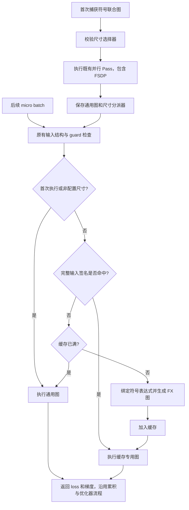

# 第二阶段：通用符号图与按尺寸懒生成专用图

本次在 `/home/whh/0929_newdynamic` 完成了 MagiCompiler “One general-shape graph + lazy per-size compilation” 的功能穿刺。默认行为不变；设置 `compile_sizes` 后，运行时可以生成具体输入尺寸的 FX 图、缓存并分派，其他尺寸继续执行通用图。

这里的“编译”是绑定 shape 表达式、创建独立 FX GraphModule 并生成 Python 执行代码。当前未接入 Inductor、NPU kernel 编译或 NPU Graph capture，不承诺加速。未能绑定的表达式保留动态形式，因此不把专用图称为完全静态的底层执行产物。

代码和行号核对日期：2026-09-30。本文链接相对于仓库根目录。

## 1. 与 MagiCompiler 的对应关系

参考实现为 [MagiCompiler 的 piecewise_backend.py:31](MagiCompiler/magi_compiler/magi_backend/piecewise_backend.py#L31)。其 `ConcreteSizeEntry` 记录专用尺寸产物，`PiecewiseBackend.__call__()` 首次执行通用图，之后对配置的尺寸懒调用 `compiler_manager.compile()` 并缓存。

| MagiCompiler | 本次 HyperParallel |
| --- | --- |
| general-shape callable | 保留原有 `JointGraph.graph_module` |
| `compile_sizes` | 同名 YAML / Python 参数 |
| 首次运行通用图 | 相同策略，首次即命中热点尺寸也先执行通用图 |
| `sym_shape_indices[0]` | 自动选择第一个符号输入维度，也允许显式指定张量路径和轴 |
| `ConcreteSizeEntry` | 保存 runtime size、专用 GraphModule、折叠节点数 |
| `compiler_manager.compile()` | `specialize_graph()` 绑定 shape 表达式并生成 FX 代码 |
| 按尺寸分派 | 尺寸筛选 + 完整输入元数据缓存键 |
| 专用 backend 编译 / 持久缓存 | 本次没有实现 |

MagiCompiler 仓库保持独立，HyperParallel 不导入它，也没有复制其 backend 编译体系。

## 2. 使用方法

在现有动态 YAML 的 `compile` 下增加后三项即可：

```yaml
compile:
  enabled: true
  use_joint_graph: true
  dynamic: true
  compile_sizes: [116, 118, 124, 128]
  compile_size_input: model_inputs.input_ids
  compile_size_dim: 1
  max_specializations: 8
```

参数定义在 [build_options.py:125](hyper_parallel/models/build_options.py#L125)，继承 trainer 配置的逻辑在 [compiler.py:110](hyper_parallel/compile/compiler.py#L110)。

| 参数 | 含义 |
| --- | --- |
| `compile_sizes` | 需要生成专用图的非负整数尺寸列表；默认 `None`，空列表也关闭此功能；需要启用动态模式 |
| `compile_size_input` | 用于尺寸筛选的输入张量路径；默认自动选择扁平用户输入中的第一个符号维度 |
| `compile_size_dim` | 显式张量路径对应的轴，默认 `-1`，支持负轴；自动选择时不使用此项 |
| `max_specializations` | 每个 GraphCompiler 最多缓存的输入签名数，默认 8；达到上限后新签名执行通用图 |

路径从 `forward_backward(**inputs)` 的顶层关键字开始。BaseTrainer 下为 `model_inputs.input_ids`；直接使用 `compiler.forward_backward(x=x)` 时可写 `x`。建议文本训练显式设置路径和序列轴，避免自动选择到另一个动态维度。

`GraphCompiler` 和 `GraphTrainer` 都支持直接传入这些参数。例如：

```python
compiler = GraphCompiler(
    model, train_fn,
    pass_config=PassConfig(fsdp_enabled=False),
    dynamic_arg_dims={"x": [0, 1], "y": [0, 1]},
    compile_sizes=[5, 7],
    compile_size_input="x",
    compile_size_dim=1,
)
```

完整 CPU 示例为 [size_specialization.py:29](hyper_parallel/compile/examples/size_specialization.py#L29)：

```bash
cd /home/whh/0929_newdynamic
python -m hyper_parallel.compile.examples.size_specialization
```

示例依次执行长度 `5 → 7 → 7 → 9 → 5 → 5`，预期分派为：通用图、生成 7 的专用图、命中缓存、通用图、生成 5 的专用图、命中缓存；同时比较每一步 eager loss 和参数梯度。

## 3. 接入位置与调用流程



主要入口：

| 位置 | 职责 |
| --- | --- |
| [compiler.py:197](hyper_parallel/compile/compiler.py#L197) | 在并行 Pass 改写模型前校验尺寸选择器，避免错误配置留下分片副作用 |
| [graph_tracer.py:614](hyper_parallel/compile/tracer/graph_tracer.py#L614) | 增加可选分派器，仍统一进行 guard 与输出拆分 |
| [size_specialization.py:157](hyper_parallel/compile/size_specialization.py#L157) | 首次通用执行、热点筛选、缓存查询、容量回退 |
| [size_specialization.py:49](hyper_parallel/compile/size_specialization.py#L49) | 创建真实的专用 FX 图 |
| [compiler.py:163](hyper_parallel/compile/compiler.py#L163) | 提供只读快照 `specialization_stats` |

通用图依旧保存在 `_joint_graph`，梯度顺序与 `loss_dict` 输出契约不变。专用图执行发生在 `run_traced_graph()` 原有 `torch.no_grad()` 区域内。

## 4. 专用图如何生成

关键代码在 [size_specialization.py:57](hyper_parallel/compile/size_specialization.py#L57)：

```python
guards = joint_graph.input_guards
tensors = [value for value in user_inputs if isinstance(value, torch.Tensor)]
bindings = guards.shape_env.bind_symbols(guards.fake_tensors, tensors)
```

例如通用图中的 batch 与 sequence 符号为 `s0`、`s1`，当前输入为 `[2, 7, 4]`，绑定结果给出 `s0=2`、`s1=7`。随后遍历通用图，只处理白名单内的纯 shape 查询与整数算术；对应的 `node.meta['val']` 必须为 `SymInt`，且替换符号后可以确定为整数。

```python
concrete = value.node.expr.xreplace(bindings)
if isinstance(concrete, int) or (not concrete.free_symbols and concrete.is_Integer):
    replacements[node] = int(concrete)
    folded += 1
    continue
```

上面是 [第 67 行](hyper_parallel/compile/size_specialization.py#L67) 的实际代码。概念上，通用图里的：

```python
length = torch.ops.aten.sym_size.int(x, 1)
batch = torch.ops.aten.sym_size.int(x, 0)
flattened = batch * length
view = torch.ops.aten.view.default(x, [flattened, 4])
```

在该输入签名下可以生成：

```python
view = torch.ops.aten.view.default(x, [14, 4])
```

其余节点通过 `graph.node_copy()` 复制，最后 `fx.GraphModule(original_module, new_graph)` 生成独立执行代码。不会修改通用图；不会实际运行 forward/backward；不会执行通信或消耗 RNG；不会把权重、标量 token 计数或用户张量数据替换成捕获时的值。符号 Tensor 元数据从复制节点中移除，避免把旧符号元数据误当作专用图的具体元数据。

这是功能穿刺中的实际特化步骤，并非多个缓存键引用同一份通用 callable。单测检查了新代码确有变化、shape 查询被消除，并检查数值结果。

## 5. FSDP 与缓存正确性

专用图从完成并行 Pass 的图派生，其中已经包含 all-gather、reduce-scatter 和相应等待节点。本次不会再次调用 `trace_model_graph()` 或 `FSDPPass.run()`，所以不会对真实参数再分片，也不会重复插入通信。

缓存键位于 [size_specialization.py:137](hyper_parallel/compile/size_specialization.py#L137)，包括所有用户张量的 shape、stride、storage offset、dtype、device、layout、requires_grad，以及 Python 叶子值。只用序列长度作为缓存键是不够的：`[2,7,4]` 和 `[3,7,4]` 会绑定出不同的展平长度，必须分别缓存。

每次执行都先经过通用图 guard，包括缓存命中的执行。改变关联输入尺寸、dtype 或原有 Python 形状分支时，仍然按既有策略报错。尺寸特化没有扩大通用图所接受的输入范围，也没有实现 guard 失败后的自动 retrace。

缓存存储图和元数据，不保存真实用户输入或张量存储。模型参数与 token 计数每次仍从显式图输入读取，因此优化器更新后的权重、变化的 token 权重和梯度累积继续有效。各 rank 独立决定缓存命中；生成图不执行 collectives，因此不同 DP 组可以在不同 micro step 生成自己的专用图。

## 6. 四卡 NPU 功能验证

本次使用原有 Qwen3-0.6B 模型结构、torch + torch_npu、TP2 + FSDP2 和真实 online dynamic batching。保留工作区既有的 `load_base_model=False` 设置，因此为随机初始化模型结构的功能验证。每个 rank 完成 12 个 micro step 和 6 个 optimizer step；所有记录 loss 有限。

| rank | 通用图捕获 | 专用图生成 | 专用图尺寸 | 专用执行 / 缓存命中 | 通用执行 |
| --- | --- | --- | --- | --- | --- |
| 0、1（分别） | 1 | 3 | 116、124、128 | 10 / 7 | 2 |
| 2、3（分别） | 1 | 1 | 118 | 3 / 2 | 9 |

每份专用图折叠 87 个 shape 计算节点。rank 0/1 的累计折叠数为 261；rank 2/3 为 87。这里的“通用图捕获次数”和 `specialization.compilations` 是两种不同计数：前者记录模型联合图捕获，后者记录 FX 尺寸专用代码生成。

复现命令如下；当前目录须为仓库根目录，端口应空闲：

```bash
cd /home/whh/0929_newdynamic
python -m hyper_parallel.compile.examples.automodel_text_graph.prepare_dynamic_text

ASCEND_RT_VISIBLE_DEVICES=0,1,2,3 \
MASTER_PORT=29844 \
OUTPUT_DIR=/home/whh/0929_newdynamic/output/automodel_text_graph/specialized_npu \
TRAIN_ENTRY=/home/whh/0929_newdynamic/hyper_parallel/compile/examples/automodel_text_graph/verify_dynamic_training.py \
bash hyper_parallel/compile/examples/automodel_text_graph/run.sh \
  hyper_parallel/compile/examples/automodel_text_graph/train_online_lm_graph_dynamic_tp2_fsdp2.yaml \
  --model.pretrained_model_name_or_path=/home/whh/used/hyper_dev/.assets/models/Qwen3-0.6B \
  '--compile.compile_sizes=[116,118,124,128]' \
  --compile.compile_size_input=model_inputs.input_ids \
  --compile.compile_size_dim=1
```

在其他模型或 tokenizer 下，实际 packing 长度可能不同，热点列表应选该数据中会重复出现的长度。

日志和审计文件位于 `/home/whh/0929_newdynamic/output/automodel_text_graph/specialized_npu/`。`dynamic_audit_rank<N>.json` 新增 `specialization` 字段；每步记录增加 `dispatch`。审计入口除检查原有训练完成条件外，还要求专用图生成、缓存命中和 shape 节点折叠实际发生。

## 7. 测试范围与后续扩展

新增 [test_size_specialization.py](tests/ut/compile/test_size_specialization.py) 覆盖首次执行、懒生成、缓存命中、冷尺寸回退、其他维度变化、缓存容量、权重更新、梯度累积、运行期标量权重、guard 优先级、自动/嵌套选择、真实输入存储释放和 RNG 行为。

两进程 Gloo/FSDP 测试覆盖特化开关与 overlap 开关的四种组合，比较真实梯度分片和 SGD 更新。NPU causal loss 测试覆盖 FP32/BF16，长度 `5 → 7 → 7 → 11`，比较 eager loss 与所有参数梯度。

本次运行结果：上述单测回归共 **232 passed**；Gloo 测试每个进程 **4 passed**；NPU 薄入口 **1 passed**，内部执行两种 dtype 与特化开关的四种组合。CPU 可运行示例也已通过。

```bash
python -m pytest tests/ut/compile tests/ut/trainer tests/ut/auto_models/trainer \
  tests/ut/auto_models/test_build_options.py -q
torchrun --standalone --nnodes=1 --nproc-per-node=2 -m pytest \
  tests/torch/compile/_test_dynamic_shapes.py -q
python -m pytest tests/torch/compile/test_dynamic_shapes.py::test_dynamic_causal_loss_npu -q
```

完整 Qwen 训练验证的是分派闭环、有限 loss 和正常训练步数，不是逐参数 eager 精度测试或性能基准。小模型已经完成 loss/梯度数值对照。

后续可以在 `specialize_graph()` 返回 FX 图之后增加可选后端编译，再让缓存条目保存后端 callable；本次输入/输出契约与 guard 入口可以沿用。动态 PP、自动 retrace、磁盘缓存、缓存淘汰和跨进程共享目前均未加入。
